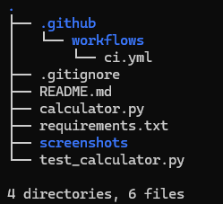
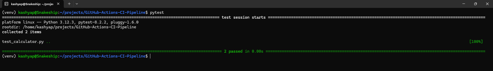
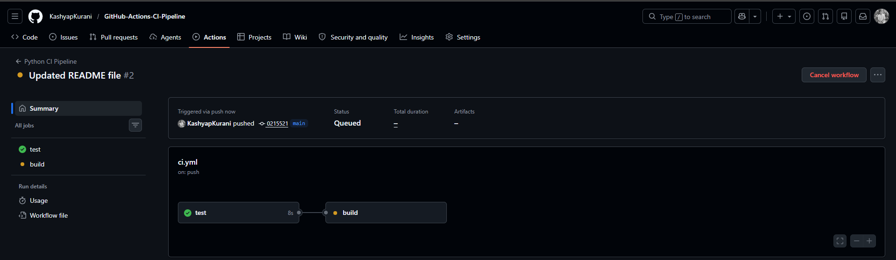
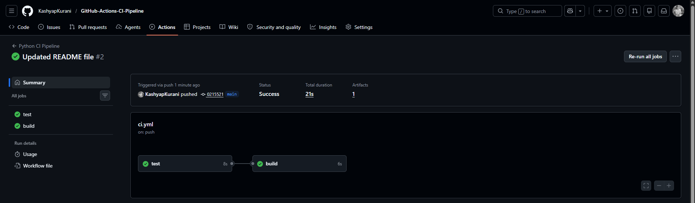
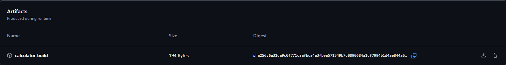
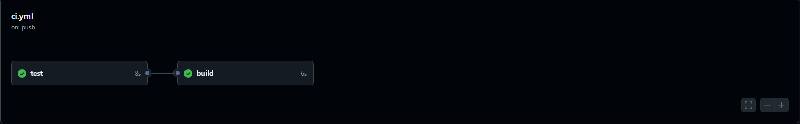

# GitHub Actions CI Pipeline

## Project Overview

This project demonstrates a basic Continuous Integration (CI) pipeline using GitHub Actions.

The workflow automatically runs whenever code is pushed to the `main` branch or when a Pull Request is created. It performs code quality checks, executes automated tests, and generates a build artifact.

The primary objective of this project is to understand GitHub Actions fundamentals, including workflows, jobs, runners, actions, artifacts, and job dependencies.

---

## Project Architecture

```text
Developer Push
      │
      ▼
GitHub Actions Trigger
      │
      ▼
+-------------------+
|      TEST JOB     |
+-------------------+
| Checkout Code     |
| Setup Python      |
| Install Packages  |
| Run Flake8        |
| Run Pytest        |
+-------------------+
      │
      ▼
+-------------------+
|     BUILD JOB     |
+-------------------+
| Checkout Code     |
| Create Artifact   |
| Upload Artifact   |
+-------------------+
      │
      ▼
Workflow Success
```

---

## Technologies Used

* Git
* GitHub
* GitHub Actions
* Python
* Pytest
* Flake8
* YAML

---

## Project Structure

```text
GitHub-Actions-CI-Pipeline/
│
├── .github/
│   └── workflows/
│       └── ci.yml
│
├── calculator.py
├── test_calculator.py
├── requirements.txt
├── .gitignore
├── README.md
│
└── screenshots/
```

---

## Workflow Features

### Test Job

The Test Job performs the following tasks:

* Checks out the repository
* Configures Python runtime
* Installs required dependencies
* Runs Flake8 linting checks
* Executes Pytest test cases

### Build Job

The Build Job executes only after the Test Job succeeds.

Tasks performed:

* Checks out repository code
* Creates a build directory
* Copies application files
* Uploads build artifact to GitHub

---

## GitHub Actions Used

### actions/checkout@v4

Checks out repository code onto the GitHub Actions runner.

### actions/setup-python@v5

Installs and configures the required Python version.

### actions/upload-artifact@v4

Uploads generated build files as workflow artifacts.

---

## Workflow Trigger Events

The workflow executes automatically on:

```yaml
push:
  branches:
    - main

pull_request:
  branches:
    - main
```

---

## Screenshots

### Project Structure



### Pytest Success



### Workflow Running



### Workflow Success



### Artifact Uploaded



### Workflow Graph



---

## How to Run Locally

Clone the repository:

```bash
git clone <repository-url>
cd GitHub-Actions-CI-Pipeline
```

Create virtual environment:

```bash
python3 -m venv venv
source venv/bin/activate
```

Install dependencies:

```bash
pip install -r requirements.txt
```

Run linting:

```bash
flake8 .
```

Run tests:

```bash
pytest
```

---

## Key Concepts Learned

* Continuous Integration (CI)
* GitHub Actions Workflows
* Workflow Triggers
* Jobs and Steps
* GitHub Hosted Runners
* Automated Testing
* Code Linting
* Build Artifacts
* Job Dependencies using `needs`
* YAML Workflow Configuration

---

## Future Improvements

* Add Docker image build stage
* Add code coverage reporting
* Integrate security scanning
* Deploy artifacts automatically
* Add multi-environment workflows
* Integrate notifications using Slack or Email

---

## Author

Kashyap Kurani

Cloud & DevOps Engineering Portfolio Project
